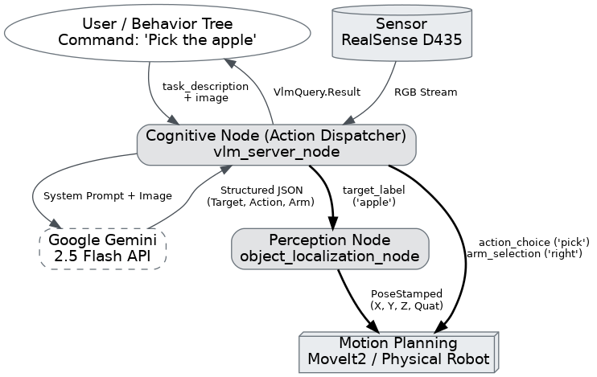

# Reasoning Pipeline — Walkthrough

## Objective

The **reasoning pipeline** acts as the cognitive layer of the system: it receives a natural language command (e.g., "pick up the red cup") along with an image of the scene, and produces a **structured analytical decision** detailing what to target, which primitive action to perform, which robotic arm to use, and why. It leverages Google's **Gemini 2.5 Flash** model as its Vision-Language Model (VLM).

---

## System Architecture



The end-to-end flow demonstrates how the VLM functions as an **Action Dispatcher**:
1. The client sends a text command (+ optional image) to the `vlm_server_node`.
2. The node dispatches the image + prompt (embedding kinematic rules) to **Google Gemini**.
3. Gemini returns not only the target label, but **the entire action parameterization** (e.g., `action: pick`, `arm: right`).
4. The `vlm_server_node` extracts the `target_label` ("apple") and delegates it to the perception node.
5. The perception node computes and returns the 3D `PoseStamped` of said object.
6. At this stage, the system possesses the **action**, the **arm choice**, and the **spatial coordinates**, funneling them into the Motion Planner (MoveIt2) for immediate physical execution.

---

## Related Files

| File | Role | Lines |
|---|---|---|
| [VlmQuery.action](file:///home/falco_robotics/mm_ws/src/franka_custom_interfaces/action/VlmQuery.action) | ROS 2 Action Interface Definition | 15 |
| [vlm_server_node.py](file:///home/falco_robotics/mm_ws/src/fr3_application/fr3_application/vlm_server_node.py) | Action Server handling Gemini API calls | 228 |
| [test_integrated_pipeline.py](file:///home/falco_robotics/mm_ws/src/fr3_application/fr3_application/test_integrated_pipeline.py) | End-to-end pipeline testing CLI client | 169 |

---

## 1. Action Interface: VlmQuery.action

```
# Request (Goal)
sensor_msgs/Image image_raw       # Optional image of the task scene
string task_description           # Natural language command

---
# Result
bool success                      # Query execution success flag
string target_label               # Output target object ("red cube", "apple", "none")
string action_choice              # Output primitive action ("pick", "place", "push", "handover", "none")
string arm_selection              # Output arm choice ("left", "right", "bimanual")
string reasoning                  # Detailed step-by-step logical reasoning
float32 handover_height_z         # Safe Z height for handovers (0.0 if not applicable)

---
# Feedback
string current_state              # Current node status (e.g., "Sending request to Gemini...")
```

The interface is architected to separate the **cognitive planning** (which object, which action, which arm) from the **physical localization** (where the object is mathematically located in 3D space).

---

## 2. VLM Server Node — Code Explanation

### 2.1 Pydantic Schema for Structured Output (lines 47–53)

```python
class VlmDecision(BaseModel):
    reasoning: str          # Step-by-step reasoning logic
    target_label: str       # Target object
    action_choice: str      # Action ("pick", "place", "push", "handover", "none")
    selected_arm: str       # Arm ("left", "right", "bimanual")
    handover_height_z: float # Safe Z height (0.0 if not applicable)
```

> **Why is `reasoning` the first field?**
> Forcing Gemini to output its reasoning *before* arriving at the final categorical decisions produces significantly higher accuracy. This is a well-known prompt engineering technique called *Chain-of-Thought*.

This schema is passed to the Gemini API as a `response_schema`, strictly enforcing that the output payload is **always** a valid JSON object matching these exact fields.

### 2.2 Initialization and Gemini Client (lines 56–96)

```python
api_key = os.environ.get("GEMINI_API_KEY")
self.gemini_client = genai.Client(api_key=api_key)
self.model_name = "gemini-2.5-flash"
```

- The API key must be set as an environment variable: `export GEMINI_API_KEY="..."`
- The `gemini-2.5-flash` model is utilized for its latency optimization and robust multimodal capabilities (native image comprehension).
- The subscriber continuously buffers frames from `/camera/color/image_raw` and converts them to `PIL.Image` formats for Gemini consumption.

> **Topic Note:** The subscriber is currently listening to `/camera/color/image_raw`. This will likely require an update to `/camera/camera/color/image_raw` to function properly within the Docker network namespace, similarly to the perception pipeline fixes.

### 2.3 Image Acquisition Strategy (lines 130–148)

The node supports **two modalities** for image intake:

1. **Goal Image Override**: The client can embed an image directly inside the goal request message.
2. **Latest Camera Buffer**: If the goal omits the image, the node falls back to the latest frame buffered by the topic subscriber.
3. **Text-Only Fallback**: If no imagery is available conceptually, it proceeds using only standard NLP text reasoning (not recommended).

### 2.4 System Prompt — Enforcing Kinematic Constraints (lines 154–163)

The core cognitive engine is driven by the **system prompt**, which explicitly injects kinematic rules:

```
CRITICAL KINEMATIC RULES YOU MUST OBEY:
1. WORKSPACE DIVISION: Objects on the right side → right arm. Objects on the left side → left arm.
2. SINGULARITIES: An arm CANNOT safely reach to the opposite side of the table.
3. Evaluate the object's X coordinate strictly.
4. HANDOVER DYNAMICS: If a handover is requested, reliably estimate a safe intermediate Z height.
```

These constraints mirror the **genuine physical limitations** of the dual Franka Research 3 arms:
- Each individual manipulator has a restricted operational workspace boundaries.
- Reaching across the table midline induces debilitating **kinematic singularities** (loss of degrees of freedom).
- Safe bimanual handovers necessitate a calculated intermediate Z location above the table.

### 2.5 Gemini API Call Execution (lines 170–184)

```python
response = self.gemini_client.models.generate_content(
    model=self.model_name,
    contents=contents,                    # [prompt, user command, image]
    config=types.GenerateContentConfig(
        response_mime_type="application/json",   # Force JSON response parsing
        response_schema=VlmDecision,             # Inject Pydantic Schema rules
        temperature=0.1,                         # Low temp → Highly deterministic
    ),
)
```

Key configuration parameters:
- `response_mime_type="application/json"` → Gemini is prohibited from returning conversational plaintext.
- `response_schema=VlmDecision` → Ensures no missing attributes or incorrect data types.
- `temperature=0.1` → Guarantees reproducible, deterministic output logic across identical requests.

### 2.6 Parsing and Validation Logic (lines 186–204)

```python
decision = VlmDecision.model_validate_json(text_response)

result.target_label = decision.target_label            # e.g. "red cube"
result.action_choice = decision.action_choice          # e.g. "pick"
result.arm_selection = decision.selected_arm           # e.g. "right"
result.handover_height_z = decision.handover_height_z  # e.g. 0.3
result.reasoning = decision.reasoning                  # step-by-step logic
```

Pydantic's `model_validate_json()` rigidly checks that every JSON node parses exactly correctly. If Gemini hallucinates a bad data type, it gets safely trapped as Python exception logic.

---

## 3. End-to-End Integrated Testing — test_integrated_pipeline.py

This script systematically validates the **entire multi-node chain** VLM → Localization.

1. The script dispatches a text task (`Pick red cube`) to the VLM server.
2. The server acquires the prompt and image, querying the Gemini API.
3. Gemini returns the target (`red cube`), action (`pick`), and arm (`right`).
4. The script relays the target `red cube` downward into the object localization node.
5. The perception node extracts physical coordinates (`X, Y, Z`) and the estimated quaternion.
6. The script displays a formatted testing dashboard bridging both systems.

### Script Execution Trace Console Output:
```
==============================================
TEST SUMMARY (What gets sent to moveit/planner):
EXECUTE: PICK
ROBOT ARM: RIGHT
DESTINATION: (x=0.147, y=-0.078, z=0.523)
==============================================
```

### How to Run the Comprehensive Test:

```bash
# Terminal 1: RealSense Drivers
ros2 launch realsense2_camera rs_launch.py align_depth.enable:=true ...

# Terminal 2: Perception Node Server
ros2 run fr3_application object_localization_node

# Terminal 3: Cognitive Reasoning Server
export GEMINI_API_KEY="your-api-key-here"
ros2 run fr3_application vlm_server_node

# Terminal 4: The Integrated Test Dispatcher Client
ros2 run fr3_application test_integrated_pipeline "Pick up the bottle"
```

---

## Known Issues to Address

| # | Issue | Status |
|---|---|---|
| 1 | **Incorrect Topic** inside VLM subscriber: `/camera/color/image_raw` likely needs update to `/camera/camera/color/image_raw` | Pending Fix |
| 2 | **QoS Mismatch**: the VLM subscriber uses default QoS (RELIABLE) whereas RealSense inherently limits to BEST_EFFORT | Pending Fix |
| 3 | **End-to-end execution script** awaits testing on live hardware | To be tested |
| 4 | Semantic Label Variance: Gemini output labels ("red cube") might miss COCO labels from YOLO ("cube") | Potential future issue |

---

## Next Steps

1. **Apply QoS & Topic Mismatch fixes** to `vlm_server_node.py` (identical to the perception patches).
2. **Execute standalone VLM Validation**: transmit single goals with offline images to test Gemini validation schema responses.
3. **Execute Unified Pipeline Testing**: run the `test_integrated_pipeline.py` script end-to-end against live physical scenarios.
4. **Resolve Output Label Integrity**: Ensure that descriptive labels produced by Gemini's vision capability correctly index against the YOLO dictionary index.
