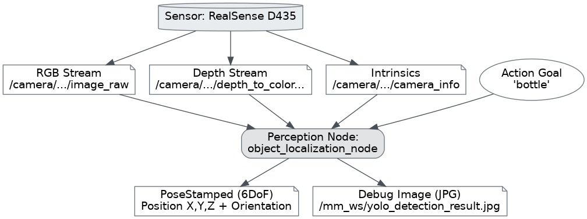

# Perception Pipeline — Session Walkthrough

## Session Objective

To validate the **perception pipeline** of the Franka FR3 bimanual system, specifically:
- Run the RealSense D435 driver natively within the Docker container
- Successfully acquire RGB and depth images
- Perform **object detection** using YOLOv8
- Calculate the **3D position** of the object (pinhole deprojection)
- Estimate the **3D orientation** of the object (PCA on the local depth region)

---

## Node Architecture

The core file is [object_localization_node.py](file:///home/falco_robotics/mm_ws/src/fr3_application/fr3_application/object_localization_node.py).



The node utilizes a ROS 2 **Action Server**: it does not process frames continuously, but only when a client sends a goal containing the target object name.

---

## Code Explanation by Section

### 1. Imports and Initialization (lines 19–38)

```python
from rclpy.qos import QoSProfile, ReliabilityPolicy, HistoryPolicy
from sensor_msgs.msg import Image, CameraInfo
from cv_bridge import CvBridge, CvBridgeError
from ultralytics import YOLO
from scipy.spatial.transform import Rotation
```

- **CvBridge**: converts `sensor_msgs/Image` ↔ NumPy/OpenCV arrays
- **YOLO**: YOLOv8n neural network for object detection (80 COCO classes)
- **Rotation (scipy)**: converts a rotation matrix into a quaternion

### 2. QoS Profile (lines 61–66)

```python
qos = QoSProfile(
    reliability=ReliabilityPolicy.BEST_EFFORT,
    history=HistoryPolicy.KEEP_LAST,
    depth=10
)
```

> [!IMPORTANT]
> The RealSense driver publishes using a **BEST_EFFORT** QoS. If the subscriber uses RELIABLE (default), messages are dropped. Understanding this mismatch was the **first bug** resolved during the session.

### 3. Subscribers (lines 72–87)

The node subscribes to **3 topics**:

| Topic | Type | Content |
|---|---|---|
| `/camera/camera/color/image_raw` | `Image` | RGB Frame 640×480 |
| `/camera/camera/aligned_depth_to_color/image_raw` | `Image` | Aligned Depth (uint16, mm) |
| `/camera/camera/color/camera_info` | `CameraInfo` | K Matrix with focal parameters |

> [!NOTE]
> The topics have the `/camera/camera/` prefix (double) because the RealSense driver inside the Docker container applies an additional namespace. Fixing this path was the **second bug** resolved.

### 4. Camera Intrinsics (lines 109–117)

```python
self.camera_intrinsics = {
    'fx': msg.k[0], 'fy': msg.k[4],
    'cx': msg.k[2], 'cy': msg.k[5]
}
```

The K matrix from `CameraInfo` is `[fx, 0, cx, 0, fy, cy, 0, 0, 1]`. The parameters are:
- **fx, fy** = focal lengths in pixels
- **cx, cy** = principal point (optical center)

Measured values from our RealSense D435: `fx=618.94, fy=618.87, cx=319.41, cy=246.62`

### 5. YOLO Inference (lines 194–222)

```python
results = self.model(cv_image, verbose=False)
for box in results[0].boxes:
    cls_id = int(box.cls[0].item())
    label = self.model.names[cls_id]    # e.g. "bottle"
    conf = float(box.conf[0].item())    # e.g. 0.76
```

YOLOv8n outputs a list of bounding boxes. For each box:
- `cls_id` → class index (0–79, COCO dataset)
- `label` → human-readable name (`"bottle"`, `"cup"`, `"person"`, etc.)
- `conf` → confidence score (0.0–1.0)
- `xyxy` → bounding box coordinates `[x1, y1, x2, y2]`

The node selects the match with the **highest confidence** for the requested object.

### 6. Pinhole Deprojection (lines 259–264)

This formula is the core logic that converts 2D pixel coordinates to 3D metric coordinates:

```python
Z = depth_value / 1000.0          # mm → meters
X = (u - cx) * Z / fx             # horizontal
Y = (v - cy) * Z / fy             # vertical
```

> [!TIP]
> This formula represents the **inverse pinhole camera model**. Given the depth Z and the pixel (u,v), it reconstructs the 3D point in the camera's optical frame.

### 7. PCA Orientation (lines 121–158)

The procedure to estimate the object's orientation is:

1. **Deproject** all valid depth pixels within the bounding box → local 3D point cloud
2. **Center** the points by subtracting the mean (centroid)
3. Calculate the 3×3 **covariance matrix**
4. Calculate **eigenvalues** and **eigenvectors** using `np.linalg.eigh()`
5. Sort by descending eigenvalue → the 1st eigenvector is the principal axis
6. Construct a **rotation matrix** and convert it to a **quaternion** using scipy

```python
cov = np.cov((pts - pts.mean(axis=0)).T)
eigenvalues, vecs = np.linalg.eigh(cov)
R = vecs.T                                # rotation matrix
quat = Rotation.from_matrix(R).as_quat()  # → [x, y, z, w]
```

> [!NOTE]
> If `det(R) < 0` the matrix is a reflection, not a proper rotation. The code corrects this by inverting the 3rd axis to ensure `det(R) = +1` (proper rotation).

### 8. Debug Image (lines 309–344)

The annotated output image includes:
- Green rectangle = YOLO bounding box
- Red circle = bounding box center
- White text = 3D coordinates (X, Y, Z in meters)
- Gray text = orientation quaternion
- Colored arrows = projected PCA axes (Red=X, Green=Y, Blue=Z)

---

## Bugs Resolved During the Session

| # | Bug | Cause | Solution |
|---|---|---|---|
| 1 | Subscriber not receiving data | QoS mismatch: RealSense publishes BEST_EFFORT, subscriber defaulted to RELIABLE | Set QoS parameter to `BEST_EFFORT` |
| 2 | Empty topics | Incorrect namespace: `/camera/color/...` vs `/camera/camera/color/...` | Corrected topic namespace paths |
| 3 | `asyncio` RuntimeError | `await asyncio.sleep()` used inside a `MultiThreadedExecutor` | Replaced with a synchronous fail-fast approach |
| 4 | PointCloud not indexable | PC2 is unorganized (height=1) → `pc[v,u]` impossible | Discarded PointCloud, switched to **aligned depth image + intrinsics** |
| 5 | `read_points(uvs=...)` crashes | Known bug in `sensor_msgs_py` on ROS 2 Humble | Entirely bypassed by the new depth image approach |
| 6 | Absurd depth reading (2.7m) | Transparent bottle: IR light passed through the glass, measuring the wall behind it | Identified and documented as a hardware limitation. Retested with opaque objects |

---

## Test Results

### Test with an opaque bottle (~52cm):
```
Found "bottle" at pixel (145, 339), conf=0.76
DEPTH DIAGNOSTIC — dtype:uint16, encoding:"16UC1", raw_center_value:523.0
3D Position: X=-0.147 Y=0.078 Z=0.523m
PCA: eigenvalues=[0.714419, 0.007893, 0.001452]
      quat=[0.019, 0.779, 0.067, 0.624]
```

- **Position**: Z=0.523m (plausible result for a ~52cm distance)
- **PCA**: λ₁/λ₂ ratio = 90× → elongated shape correctly recognized ✅
- **Detection**: 76% confidence, correctly identified vs cups and chairs ✅
- **Depth Format Confirmed**: `uint16`, encoding `16UC1`, values in millimeters ✅

---

## How to Run the Pipeline

```bash
# Terminal 1: RealSense
ros2 launch realsense2_camera rs_launch.py \
    align_depth.enable:=true enable_sync:=true \
    enable_color:=true enable_depth:=true \
    depth_module.profile:=640x480x30 rgb_camera.profile:=640x480x30

# Terminal 2: Perception Node
colcon build --packages-select fr3_application && source install/setup.bash
ros2 run fr3_application object_localization_node

# Terminal 3: Send Action Goal
ros2 action send_goal /detect_object \
    franka_custom_interfaces/action/DetectObject \
    "{object_name: 'bottle'}"
```

---

## Next Steps
- Validate measurements with **opaque** objects at known distances (using a measuring tape)
- Test the **reasoning** pipeline (`vlm_server_node.py` utilizing Gemini API)
- Test the full integrated flow using `test_integrated_pipeline.py`
