# Bimanual Franka FR3 Framework: Visual Logic & Workflows

This document centralizes the visual representations of the framework's internal logic, synchronization protocols, and behavior tree structures.

---

## 1. Functional Architecture: Custom Framework & Repertoire
This diagram illustrates the relationship between custom ROS 2 packages and the modular **Atomic Skill Repertoire**.

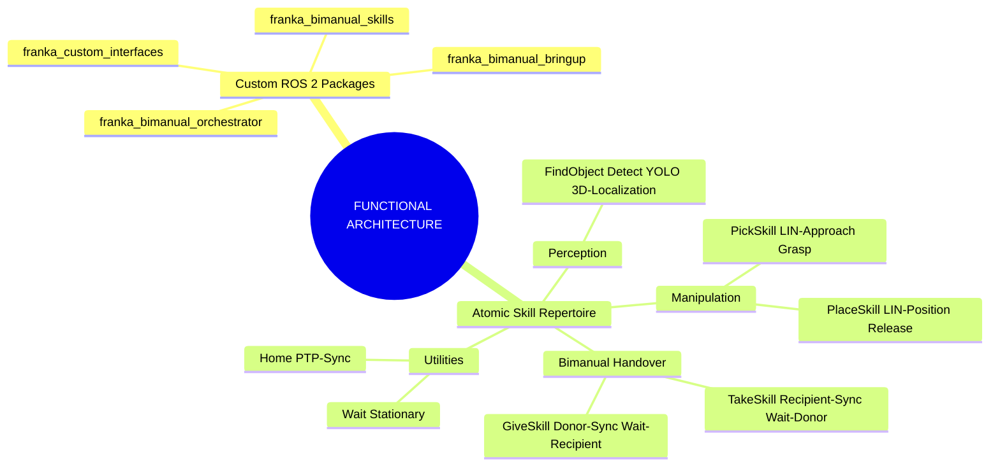

---

## 2. Perception Pipeline: From Pixels to 6DoF
The transformation of raw sensor telemetry into high-fidelity spatial telemetry.

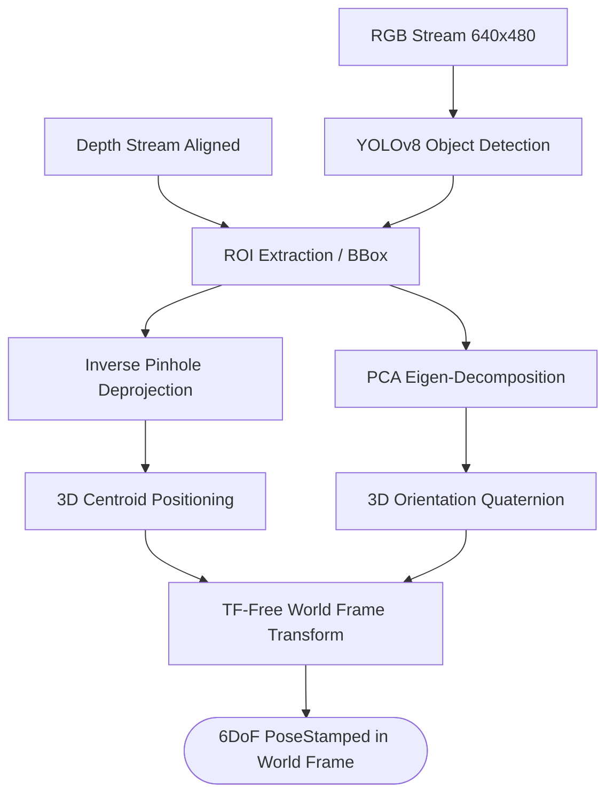

---

## 3. Reasoning Layer: Cognitive Task Planning
The transition from natural language to type-safe action sequences.

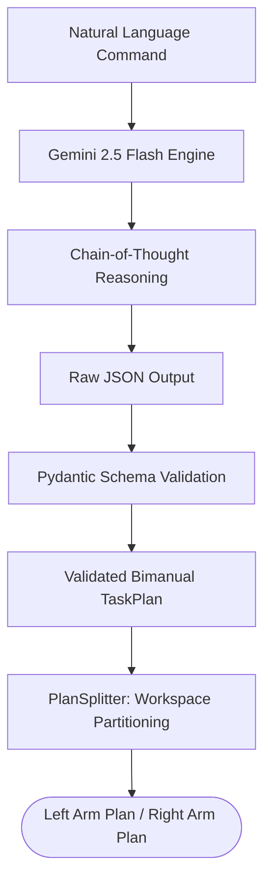

---

## 4. Behavior Tree Architecture: Mission Orchestration
The hierarchical logic that drives the parallel mission execution.

```mermaid
graph TD
    BT[Behavior Tree Root] --> Selector[Selector: Root_Guard]
    
    Selector --> Done[Condition: Mission_Done?]
    Selector --> Main[Sequence: Bimanual_Orchestrator]
    
    Main --> Gate[Selector: Planning_Gate]
    Gate --> Exists[Condition: Plan_Exists?]
    Gate --> VLM[Action: Gemini_Planner]
    
    Main --> Splitter[Action: Plan_Splitter]
    
    Main --> Parallel[Parallel: Side_By_Side_Execution]
    
    Parallel --> LeftL[Lane: LEFT_ARM]
    Parallel --> RightL[Lane: RIGHT_ARM]
    
    subgraph "Arm Execution Lane (Iterative)"
        Lane[Decorator: Repeat] --> Step[Sequence: Step_Arm]
        Step --> HasPlan[Condition: Has_Arm_Plan?]
        Step --> Iterator[Action: Dynamic_Iterator]
        Step --> Dispatcher[Selector: Dispatcher_Arm]
        Step --> Popper[Action: Plan_Popper]
    end
    
    LeftL --- Lane
    RightL --- Lane

### 4.1 Arm Lane Internal Logic: The Pipeline Pattern
Each arm execution lane operates as a deterministic consumer of the plan queue. The diagram below illustrates the state-machine logic within a single tick sequence.

```mermaid
graph TD
    Start[Tick Lane] --> Iterator[Action: Dynamic_Iterator]
    
    subgraph "Iterator Logic"
        Iterator --> Peek["Peek: action = arm_plan[0]"]
        Peek --> Inject["Inject: Update BB(target, skill, mode)"]
        Inject --> IterSuccess([Return: SUCCESS])
    end

    IterSuccess --> Dispatcher[Selector: Dispatcher_Arm]

    subgraph "Dispatcher Logic (Asynchronous)"
        Dispatcher --> CheckPick{"If skill == 'PICK'"}
        CheckPick -- Yes --> Pick[Trigger PickActionClient]
        
        Dispatcher --> CheckPlace{"If skill == 'PLACE'"}
        CheckPlace -- Yes --> Place[Trigger PlaceActionClient]
        
        Pick -- Running --> RetWait([Return: RUNNING])
        Place -- Running --> RetWait
        
        Pick -- Done --> DispSuccess([Return: SUCCESS])
        Place -- Done --> DispSuccess
    end

    DispSuccess --> Popper[Action: Plan_Popper]

    subgraph "Popper Logic"
        Popper --> Pop["Execute: arm_plan.pop(0)"]
        Pop --> PopSuccess([Return: SUCCESS])
    end

    PopSuccess --> End[Cycle Complete: Wait for Next Tick]
```
```

---

## 5. Motion Planning & Execution Stack
How high-level goals are transformed into physical joint trajectories.

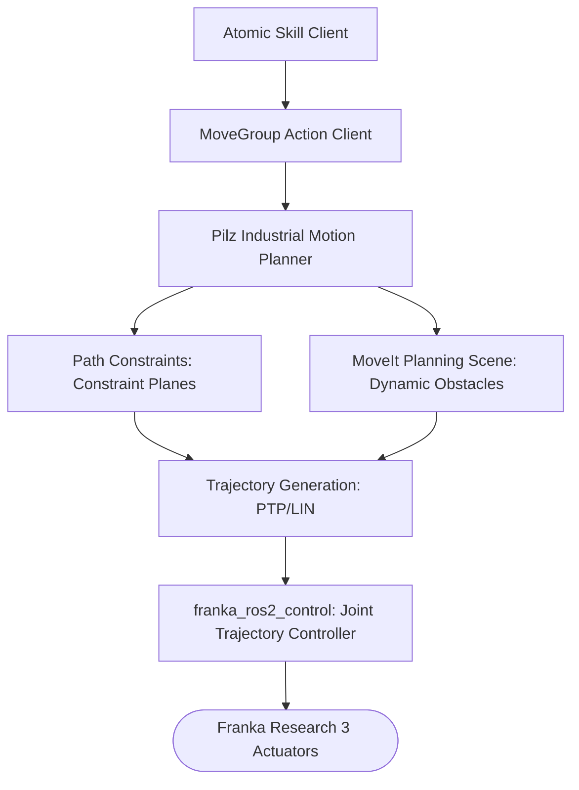

---

## 6. Bimanual Handover Workflow (Mid-Air Rendezvous)
This diagram maps the low-level Python functions and threading events used to synchronize the donor and recipient arms during a physical object transfer.

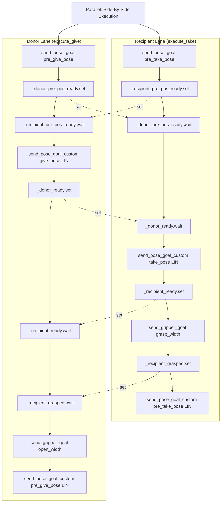

---

## 7. Technical Stack: Libraries & Middleware
Detailed overview of the third-party libraries and ROS 2 dependencies powering the framework.

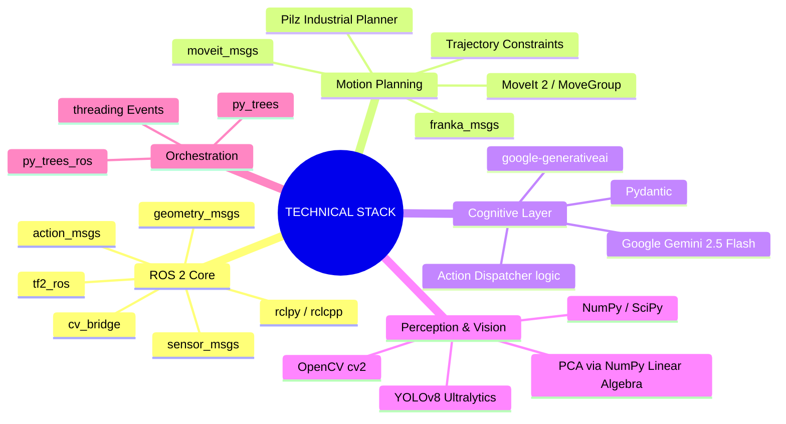
---

## 8. Atomic Skill Repertoire: Modular Execution
The framework's library of primitive behaviors, categorized by functional domain.

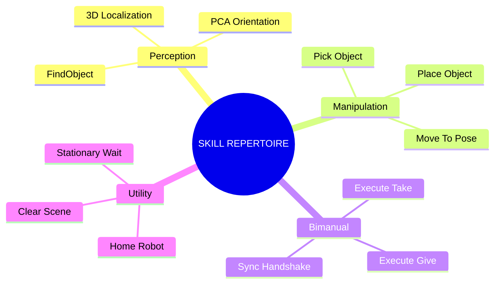

---

## 9. Parallelism Model: Logical vs. Physical Concurrency
The framework employs a two-layer parallelism strategy to ensure deterministic control and non-blocking bimanual motion.

### 9.1 Logical Concurrency (Behavior Tree Ticking)
Within the BT, the `Parallel` node manages two execution contexts. This is **logical concurrency**: the tree "taps" both branches in every tick cycle, monitoring states without blocking.

### 9.2 Physical Concurrency (ROS 2 MultiThreadedExecutor)
Underneath the BT, the ROS 2 middleware handles the actual threading. This is **physical concurrency**: callbacks from different robots are processed in parallel on separate CPU cores.

> [!IMPORTANT]
> **GIL Optimization**: The system exploits I/O-bound context switching. When an action goal is sent, the GIL is released, allowing concurrent execution of C++ backends (MoveIt/Pilz) and other Python threads.
> **Deadlock Prevention**: All custom nodes utilize an explicit **ReentrantCallbackGroup** policy. This allows the executor to process overlapping feedback/status callbacks from dual arms simultaneously, even when nested action calls are active.
> **Blackboard Safety**: The shared state is protected by an internal **Recursive Read-Write Lock (RWMutex)** within `py_trees`, ensuring atomic access for dual-arm lanes.

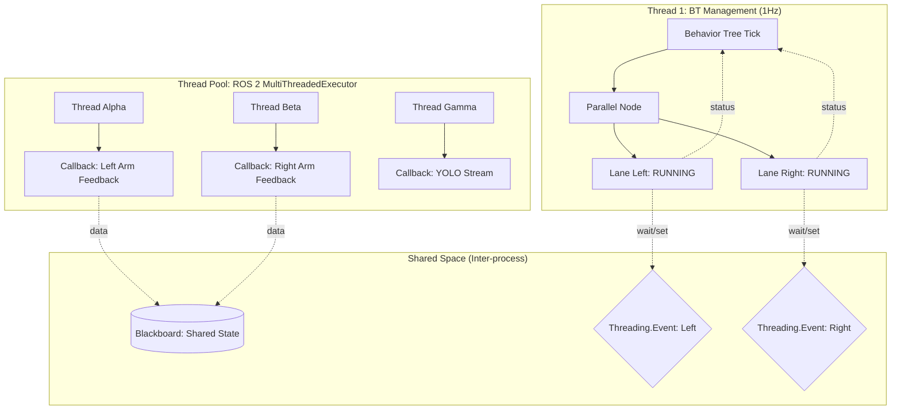

---

## 10. Design Analysis: Assumptions & Architectural Gaps
Visual overview of the system's design constraints and current technical vulnerabilities.

### 10.1 Project Design Assumptions
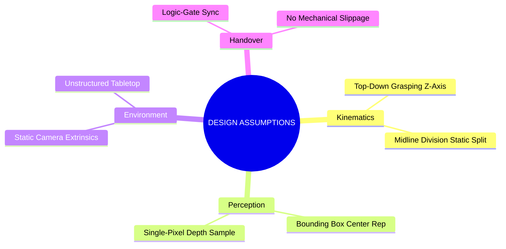

### 10.2 Architectural Gaps & Vulnerabilities
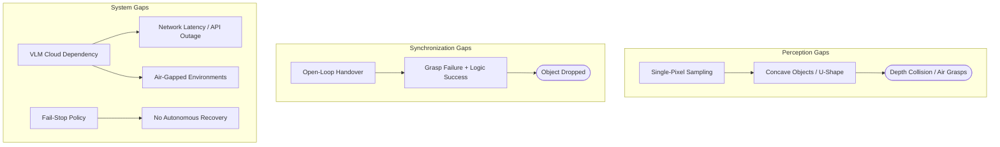

---

## 11. Future Roadmap: Advanced Framework Evolutions
Strategic technical paths for industrial-grade autonomy and physics.

### 11.1 Evolution Pillars

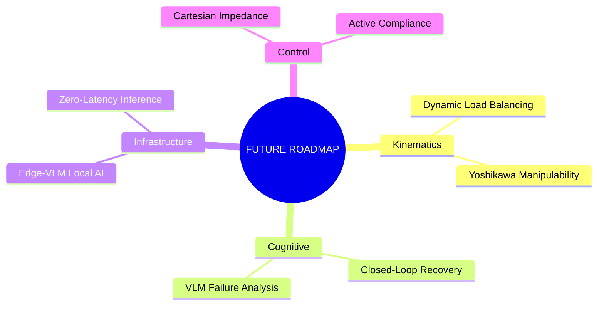

---

## 12. Experimental Metrics & Competitive Analysis
Templates for performance reporting and comparative evaluation.

### 12.1 Parallel Execution Gantt Chart (Sample Template)
This chart visualizes the bimanual concurrency enabled by the **ReentrantCallbackGroup** and the asynchronous **Behavior Tree**.


### 12.2 Comparative Analysis: White-Box Advantage
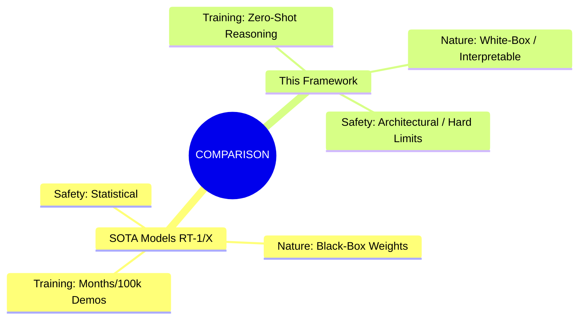

---

### 12.3 Summary of Evaluation Metrics
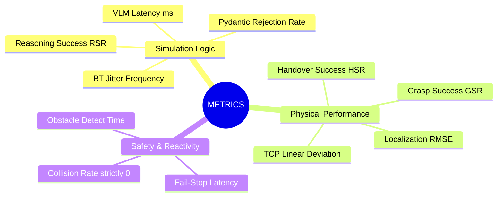

---

## 13. System Summary: The End-to-End Pipeline
A high-level view of the framework's operational flow.

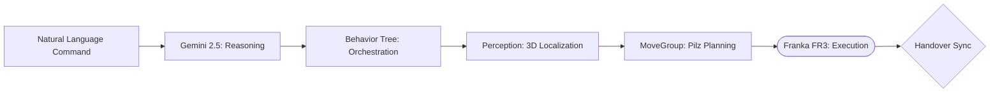

---

## 14. Simulation Progress & Deployment Milestones

This diagram summarizes the current validation status of the bimanual framework within the Gazebo/MoveIt 2 simulation environment.

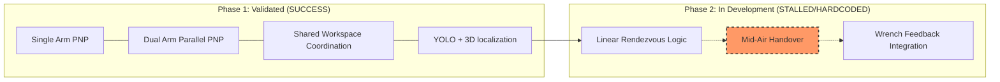

### 14.1 Status Breakdown
- **Success**: The system correctly handles **Bimanual Pick and Place** in a shared tabletop workspace. Collision avoidance is ensured by the midline spatial partitioning and MoveIt planning scene updates.
- **In-Progress**: The **Mid-Air Handover** is currently utilizing **hardcoded joint positions** for experimental validation. Continuous linear (LIN) Cartesian execution and robust threading-event handshakes are currently being refined to transition from hardcoded rendezvous to dynamic, perception-driven transfers.

